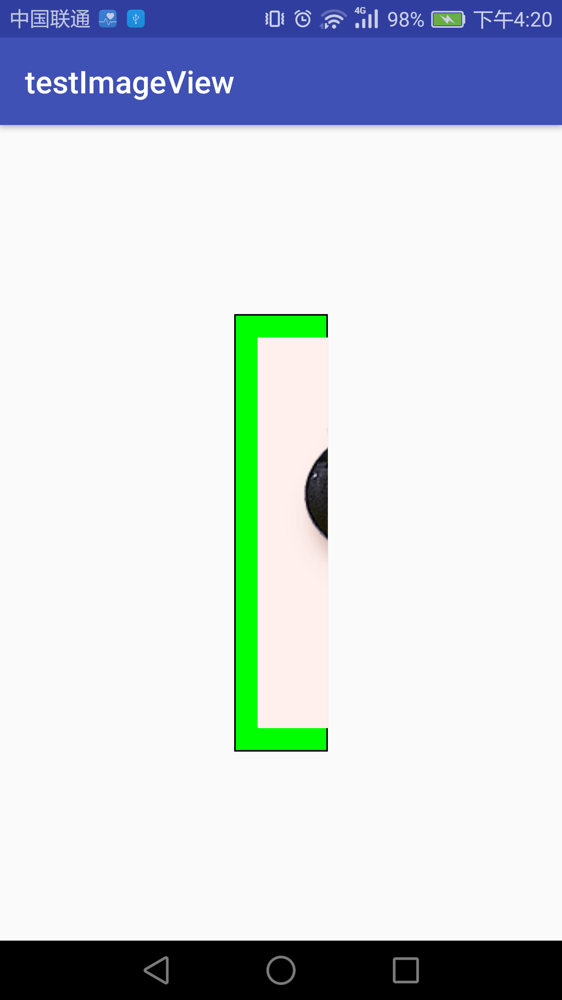
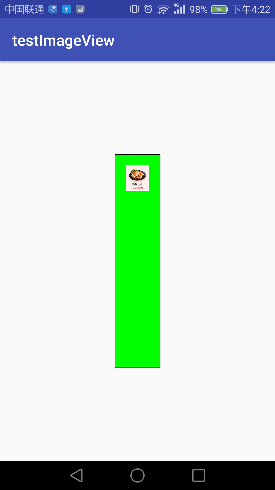
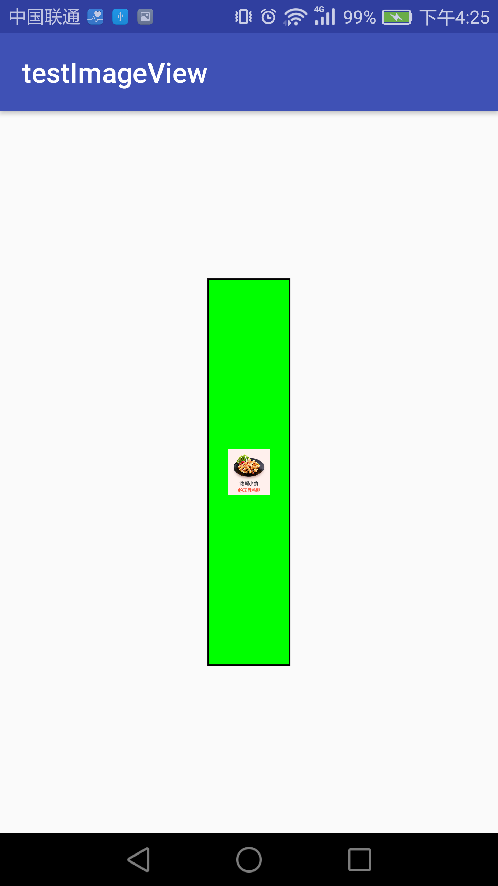
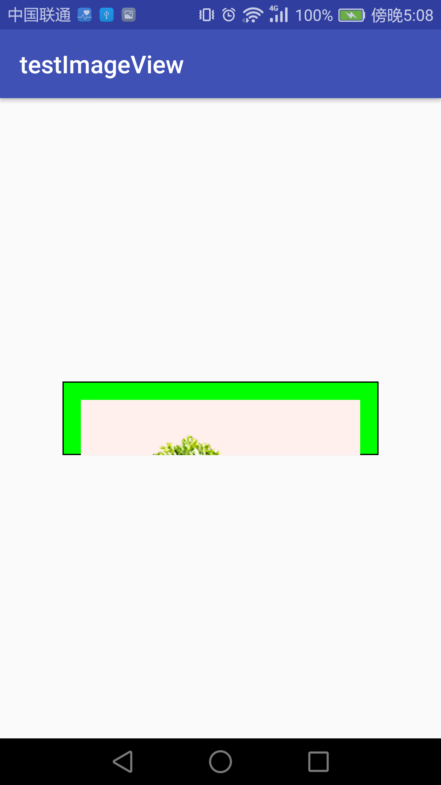
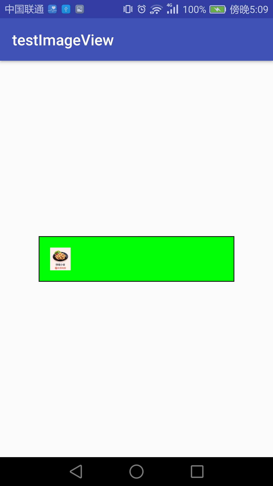
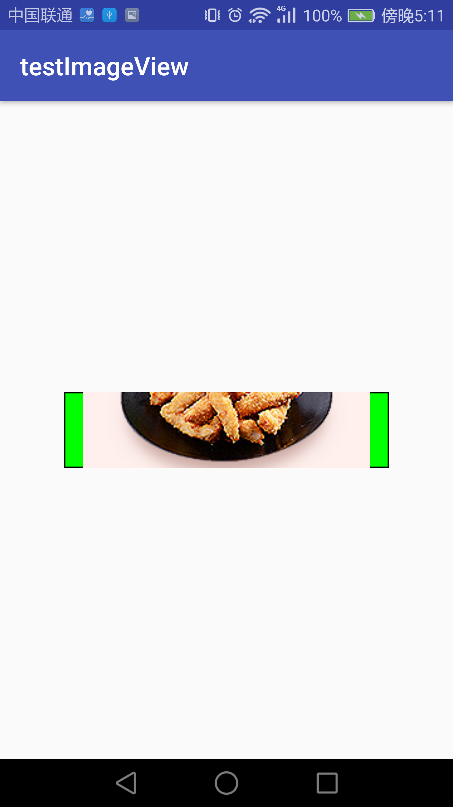
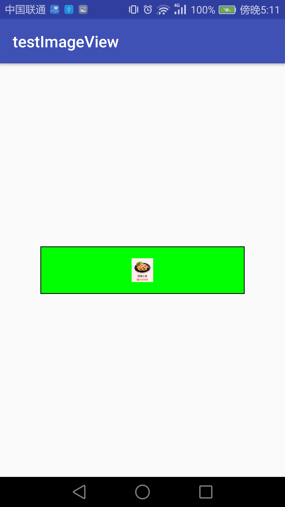
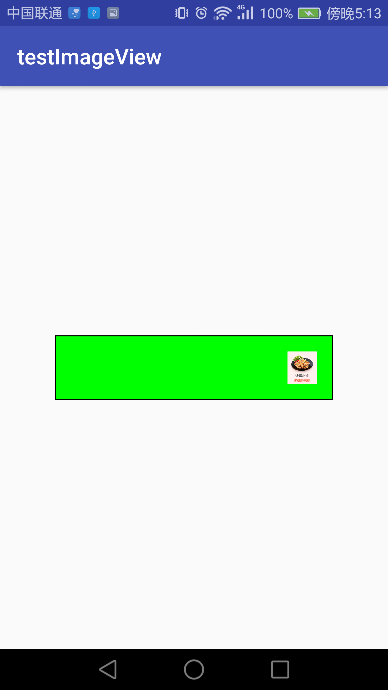

title: ImageView的scaleType属性效果
date: 2017-01-13
categories: wangweitao
tags:
- andorid
- imageView scaleType
---
android中的imageView在图片大小不完全一致时会进行相应的缩放或者裁剪。scaleType属性决定缩放裁剪的效果，这里总结了下在各种情况下的缩放裁剪效果。

<!--more-->
##ImageView中ScaleType属性效果

###imageview的宽高为wrap_content
- scaletype的值不影响结果，图片按照原有大小展示

###imageview的宽固定&高为wrap_content
- imageview宽度的值为固定值，高度按照图片的高度计算。
- 宽大于图片宽度
	- matrix：宽度靠左，填充满高度
	- fitstart：同上

	- center：宽度居中，填充满高度
	- centerInside：同上
	- fitcenter：同上

	- centerCrop：宽度填充，高度截取中间部分；图片展示不全

	- fitend：宽度靠右，填充满高度

	- fitxy：宽度填充，高度填充；图片变形

- 宽小于图片宽度
	- matrix：显示左侧部分，填充满高度

	- fitstart：宽度缩小居中，高度靠上

	- center：显示中间部分图片，填充满高度；图像显示不全
	- centerCrop：同上

	- centerInside：宽度缩小且居中，高度居中
	- fitcenter：同上

	- fitend：宽度缩小居中，高度靠下

	- fitxy：宽度缩放填充，高度缩放填充；图像变形

###imageView宽wrap_content&高固定
- imageView高大于图片高度
	- matrix：宽填充，高靠上
	- fitstart：同上

	- center：宽填充，高居中
	- centerInside：同上
	- fitcenter：同上

	- centerCrop：宽显示中间部分，高填充居中；图片显示不全

	- fitend：宽填充，高靠下

	- fitxy：宽填充，高填充；图片变形

- imageView高小于图片高度
	- matrix：宽度填充，高度显示靠上的部分；图片显示不全

	- fitstart：高度缩小居中，宽度显示靠左

	- center：宽度填充，高度显示中间的部分；图片显示不全
	- centerCrop：同上

	- centerInside：宽度缩小居中，高度缩小居中
	- fitcenter：同上

	- fitend：宽度靠右，高度缩小居中

	- fitxy：宽度填充，高度缩小；图片变形
